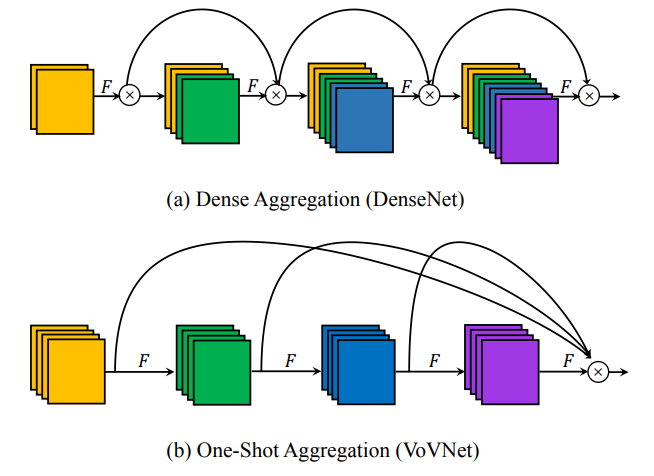

# paddle-vovnet

## 目录

- [paddle-vovnet](#paddle-vovnet)
  - [目录](#目录)
  - [1. 简介](#1-简介)
  - [2. 数据集和复现精度](#2-数据集和复现精度)
    - [复现精度](#复现精度)
  - [3. 准备数据与环境](#3-准备数据与环境)
    - [3.1 准备环境](#31-准备环境)
    - [3.2 准备数据](#32-准备数据)
  - [4. 开始使用](#4-开始使用)
    - [4.1 模型训练](#41-模型训练)
    - [4.2 模型预测](#42-模型预测)
  - [5. 模型推理部署](#5-模型推理部署)
  - [6. 自动化测试脚本](#6-自动化测试脚本)
  - [7. LICENSE](#7-license)
  - [8. 参考链接与文献](#8-参考链接与文献)


## 1. 简介

**论文:** [An Energy and GPU-Computation Efficient Backbone Network for Real-Time Object Detection](https://arxiv.org/pdf/1904.09730v1.pdf)

**参考repo:** [stigma0617/VoVNet.pytorch](https://github.com/stigma0617/VoVNet.pytorch)




在此非常感谢`stigma0617`等人贡献的[stigma0617/VoVNet.pytorch](https://github.com/stigma0617/VoVNet.pytorch)，提高了本repo复现论文的效率。

## 2. 数据集和复现精度
本次复现使用了`ImageNet1k`数据集，按如下方式组织数据
```
PaddleClas/dataset/ILSVRC2012/
|_ train/
|  |_ 23
|  |  |_ 0005.png
|  |  |_ ...
|  |_ ...
|  |
|  |_ 66
|     |_ ...
|     |_ 0001.png
|_ test/
|  |_ 22
|  |  |_ 0012.png
|  |  |_ ...
|  |_ ...
|  |
|  |_ 74
|     |_ ...
|     |_ 0006.png
|_ train_list.txt
|_ val_list.txt
```

### 复现精度
|      Model            |   Epoch       |  Top-1            |   Top-5       |
| ---------------  | --------------- |  ---------------  | --------------- | 
|  VoVNet.pytorch (原论文) |  90  |    0.7677  | 0.9343 |
|  paddle-vovnet (实现) |  90  |      |  |

- 训练权重及训练日志下载地址：

## 3. 准备数据与环境


### 3.1 准备环境
- 硬件：
  - 4 * V100
- 框架：
  - paddlepaddle-gpu >= 2.2.0

运行`pip install paddlepaddle-gpu`即可

- 下载PaddleClas
```
git clone https://github.com/PaddlePaddle/PaddleClas
cd PaddleClas
```
把本repo的文件夹```ppcls```, ```test_tipc```复制到PaddleClas对应的目录下

运行
```
pip install -r requirements.txt
python setup.py install
```


### 3.2 准备数据

```
bash test_tipc/prepare.sh ./test_tipc/config/VoVNet/VoVNet39_train_infer_python.txt whole_train_whole_infer
```

## 4. 开始使用

### 4.1 模型训练

```
python -m paddle.distributed.launch --selected_gpus="0,1,2,3" tools/train.py -c ./ppcls/configs/ImageNet/VoVNet/VoVNet39.yaml
```
  

### 4.2 模型预测
```
python tools/eval.py -c ./ppcls/configs/ImageNet/VoVNet/VoVNet39.yaml -o pretrained_model=./output/VoVNet39/best_model
```


## 5. 模型推理部署
暂无

## 6. 自动化测试脚本

- tipc创建指南请见[tipc创建及基本使用方法。](https://github.com/PaddlePaddle/models/blob/release/2.2/tutorials/tipc/train_infer_python/test_train_infer_python.md)
- 本项目TIPC脚本测试命令详见[Linux GPU/CPU 基础训练推理测试](test_tipc/docs/test_train_inference_python.md)
```bash
#测试环境准备脚本
bash test_tipc/prepare.sh ./test_tipc/config/VoVNet/VoVNet39_train_infer_python.txt lite_train_lite_infer
```

```bash
#测试训练验证推理一体化脚本
bash test_tipc/test_train_inference_python.sh ./test_tipc/config/VoVNet/VoVNet39_train_infer_python.txt lite_train_lite_infer
```

输出结果如下，表示命令运行成功。

```bash
 Run successfully with command - VoVNet39 - python tools/train.py -c ppcls/configs/ImageNet/VoVNet/VoVNet39.yaml -o Global.seed=1234 -o DataLoader.Train.sampler.shuffle=False -o DataLoader.Train.loader.num_workers=0 -o DataLoader.Train.loader.use_shared_memory=False -o Global.device=gpu  -o Global.output_dir=./test_tipc/output/VoVNet39/lite_train_lite_infer/norm_train_gpus_0_autocast_null -o Global.epochs=2     -o DataLoader.Train.sampler.batch_size=8   !  
 Run successfully with command - VoVNet39 - python tools/eval.py -c ppcls/configs/ImageNet/VoVNet/VoVNet39.yaml -o Global.pretrained_model=./test_tipc/output/VoVNet39/lite_train_lite_infer/norm_train_gpus_0_autocast_null/VoVNet39/latest -o Global.device=gpu  !  
 Run successfully with command - VoVNet39 - python tools/export_model.py -c ppcls/configs/ImageNet/VoVNet/VoVNet39.yaml -o Global.pretrained_model=./test_tipc/output/VoVNet39/lite_train_lite_infer/norm_train_gpus_0_autocast_null/VoVNet39/latest -o Global.save_inference_dir=./test_tipc/output/VoVNet39/lite_train_lite_infer/norm_train_gpus_0_autocast_null!  

...

 Run successfully with command - VoVNet39 - python tools/train.py -c ppcls/configs/ImageNet/VoVNet/VoVNet39.yaml -o Global.seed=1234 -o DataLoader.Train.sampler.shuffle=False -o DataLoader.Train.loader.num_workers=0 -o DataLoader.Train.loader.use_shared_memory=False -o Global.device=gpu  -o Global.output_dir=./test_tipc/output/VoVNet39/lite_train_lite_infer/norm_train_gpus_0_autocast_null -o Global.epochs=2     -o DataLoader.Train.sampler.batch_size=8   !  
 Run successfully with command - VoVNet39 - python tools/eval.py -c ppcls/configs/ImageNet/VoVNet/VoVNet39.yaml -o Global.pretrained_model=./test_tipc/output/VoVNet39/lite_train_lite_infer/norm_train_gpus_0_autocast_null/VoVNet39/latest -o Global.device=gpu  !  
 Run successfully with command - VoVNet39 - python tools/export_model.py -c ppcls/configs/ImageNet/VoVNet/VoVNet39.yaml -o Global.pretrained_model=./test_tipc/output/VoVNet39/lite_train_lite_infer/norm_train_gpus_0_autocast_null/VoVNet39/latest -o Global.save_inference_dir=./test_tipc/output/VoVNet39/lite_train_lite_infer/norm_train_gpus_0_autocast_null!  
```


## 7. LICENSE

本项目的发布受[Apache 2.0 license](./LICENSE)许可认证。

## 8. 参考链接与文献
**参考论文:** [An Energy and GPU-Computation Efficient Backbone Network for Real-Time Object Detection](https://arxiv.org/pdf/1904.09730v1.pdf)

**参考repo:** [stigma0617/VoVNet.pytorch](https://github.com/stigma0617/VoVNet.pytorch)